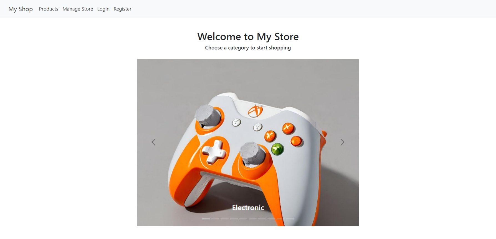
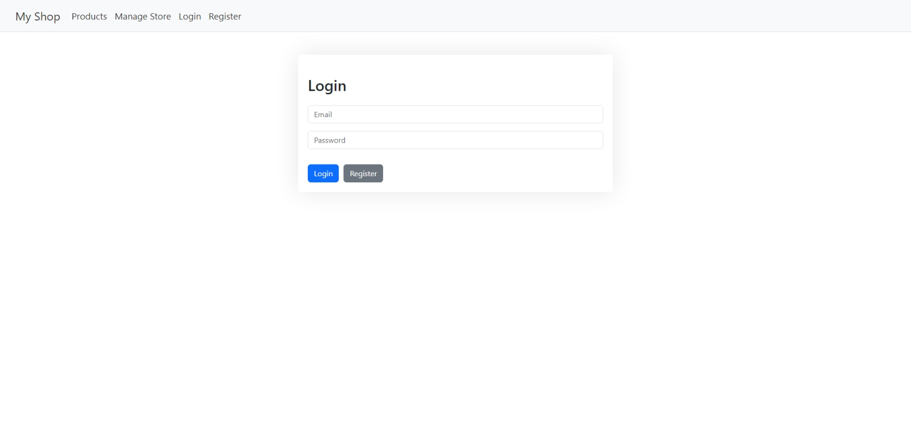
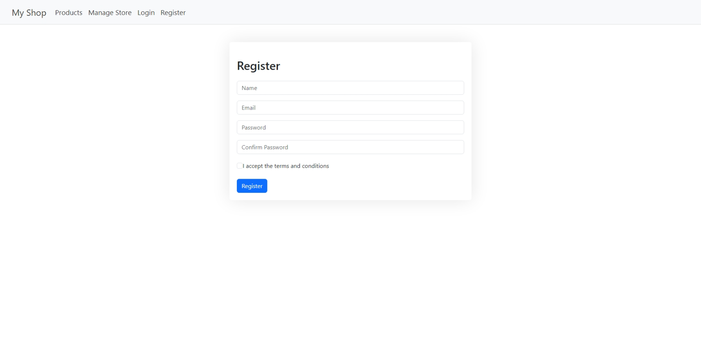
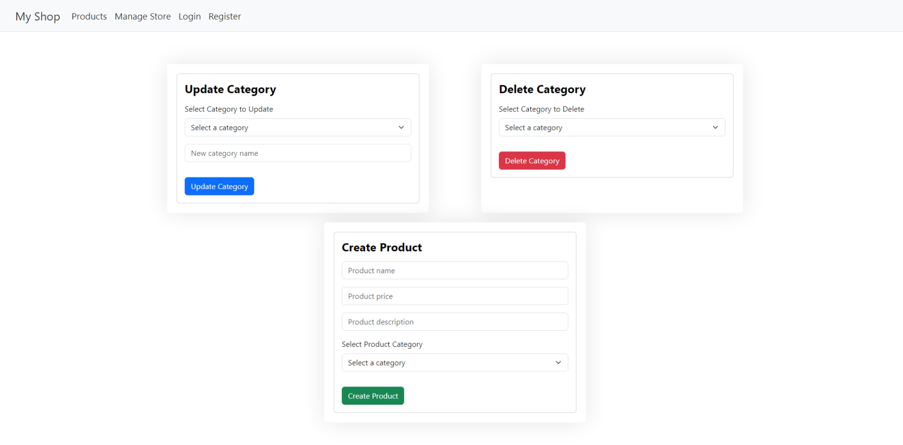
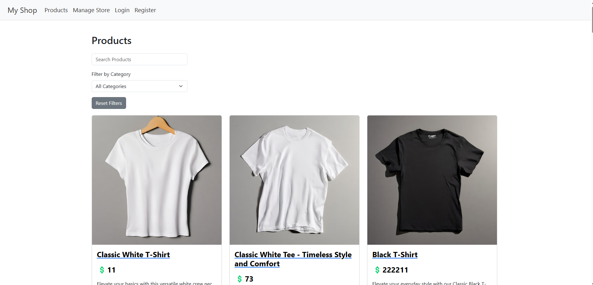
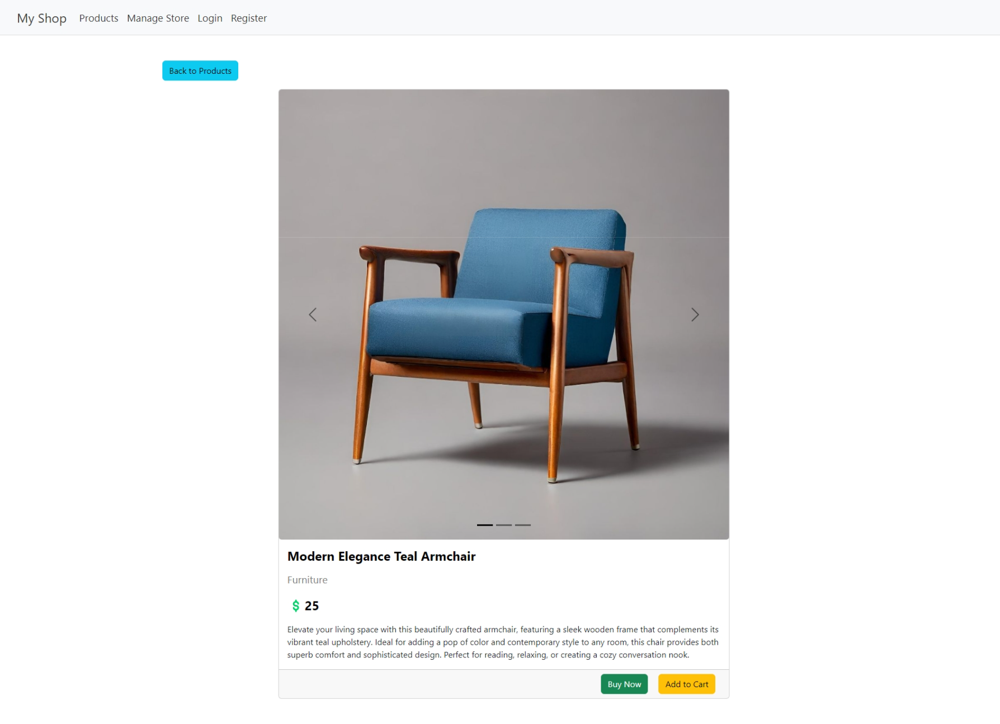

# Store App Project #

## Project Overview ##

This project is a store application built using ReactJS and NextJS. The application allows users to view products available in the store, filter products by category and name, view product details, buy products, add products to cart and manage the store by adding products to store, updating categories, and deleting categories. The application includes user authentication and category management features.

## Features ##

- **User Authentication**: Users can register and log in to the application.
- **Product Management**: Users can view, add, buy, and add products to cart.
- **Category Management**: Users can manage product categories.
- **Responsive Design**: The application is responsive and works well on different screen sizes.

## Technologies Used ##

- **ReactJS:** JavaScript library for building user interfaces. Used for building the application's user interface.
- **NextJS:** React framework for server-side rendering and static web applications. Used for routing and server-side rendering.
- **Bootstrap:** CSS framework for responsive design. Used for styling the application.
- **Reactstrap:** Bootstrap components for React. Used for styling the application.
- **Fetch API:** For making API requests.
- [**Platzi Fake Store API:**](https://fakeapi.platzi.com/) RESTful services for the project. Used for fetching and updating the store data. This API can be accessed by anyone. Therefore, the application can change over time due to other users' actions. The products and categories in the store are not static and can change over time.

## Project Structure ##

```ascii
src
 ┣ app
 ┃ ┣ components
 ┃ ┃ ┣ CreateProductForm.js
 ┃ ┃ ┣ DeleteCategoryForm.js
 ┃ ┃ ┣ Navbar.js
 ┃ ┃ ┗ UpdateCategoryForm.js
 ┃ ┣ login
 ┃ ┃ ┗ page.js
 ┃ ┣ manageStore
 ┃ ┃ ┗ page.js
 ┃ ┣ products
 ┃ ┃ ┣ [id]
 ┃ ┃ ┃ ┗ page.js
 ┃ ┃ ┗ page.js
 ┃ ┣ register
 ┃ ┃ ┗ page.js
 ┃ ┣ styles
 ┃ ┃ ┗ global.css
 ┃ ┣ layout.js
 ┃ ┗ page.js
public
 ┣ homePage.png
 ┣ loginPage.png
 ┣ manageStorePage.png
 ┣ productsPage.png
 ┗ registerPage.png
README.md
package.json
package-lock.json
```

## Installation and Running the Project ##

At first, make sure you have Node.js installed on your machine. Then, follow the steps below to install and run the project:

**Install dependencies:**

```bash
npm install
```

**Run the development server:**

```bash
npm run dev
```

**Open the application in your browser:**

```bash
http://localhost:3000
```

## Usage Scenarios ##

- **Register:** Users can create a new account by providing their name, email, and password. User's email should be unique and password should be at least 6 characters long. User should accept the terms and conditions to register. All fields are required to register.
- **Login:** Registered users can log in using their email and password.
- **View Products:** Users can view all products available in the store and filter them by category and name. Also, users can view the details of a product by clicking on the product card.
- **Buy Product:** Users can buy a product by clicking the "Buy Now" button on the product card.
- **Add Product to Cart:** Users can add a product to their cart by clicking the "Add to Cart" button on the product card.
- **Manage Store:** Admin users can manage the store by adding products to the store, updating categories, and deleting categories.

## Screenshots ##

### Home Page ###

Home page of the application includes a welcome message and available categories of products. Users can view the available categories in the carousel and click on a category to view the products in that category.



### Login Page ###

Users can log in to the application using their email and password. If the user does not have an account, they can click on the "Register" link to create a new account.



### Register Page ###

Users can create a new account by providing their name, email, and password. User's password should be at least 6 characters long, user's email should be unique, and user should accept the terms and conditions to register. All fields are required to register.



### Manage Store Page ###

Store owners can manage the store by updating and deleting the categories. The page includes a section for updating an available category's name, a section for deleting a category and a section for adding a new product to the store.



### Products Page ###

Users can view all products available in the store and filter them by category and name. Also, users can view the details of a product by clicking on the product card.



### Product Details Page ###

Users can view the details of a product by clicking on the product card. The product details page includes the product's images, name, description, price, and category. It also includes buttons for buying the product and adding the product to the cart.



## Contributors ##

- [**Turgay Bulut**](turgay.bulut@ozu.edu.tr)
